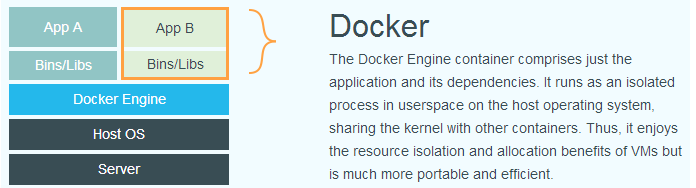
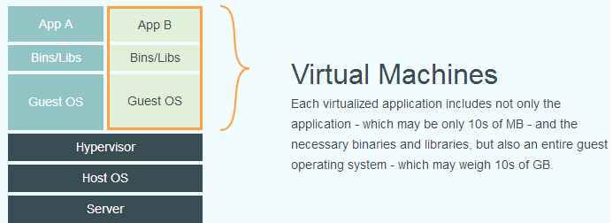

# docker

###1. 概述


官网文档链接: [docker_docs](https://docs.docker.com/get-started/)

*  基于Go语言实现的云开源项目

*  主要目标是“Build， Ship and Run Any App Anywhere”

*  通过对应用组件的封装，分发，部署，运行等生命周期的管理，使用户的App以及它的运行环境能够做到 "一次封装，处处运行"

*  解决了运行环境和配置问题软件容器，方便做持续集成并有助于真题发布的容器虚拟化技术

*  docker结构与虚拟机结构区别:





####2. docker结构
* 镜像 (image)
* 容器 (container)
* 仓库 (repository)

#####2.1 仓库
* 仓库是集中存放镜像文件的场所

* 仓库和仓库注册服务器是有区别的。仓库注册服务器上存放多个仓库，每个仓库包含多个镜像，每个镜像包含不同的标签


#####2.2 镜像技术（镜像即应用）
> 1. 运行文档
>
> 2. 配置环境
>
> 3. 运行环境
>
> 4. 运行依赖包
>
> 5. 操作系统发行版
>
> 6. 内核
    
####3.安装和部署

#####3.1 Ubantu安装
```shell script
curl -fsSL https://get.docker.com | bash -s docker --mirror Aliyun

# 或者使用：

curl -sSL https://get.daocloud.io/docker | sh
```

#####3.2 如果之前设备有安装docker，需要先卸载旧版本
```shell script
 sudo apt-get remove docker docker-engine docker.io containerd runc
```

#####3.3 设置阿里云镜像
    
默认选择下载镜像地址：[docker hub](https://hub.docker.com/)

阿里云镜像加速地址(需要注册阿里云账号)：[docker mirrors in aliyun](https://cr.console.aliyun.com/cn-hangzhou/instances/mirrors)

执行下列指令
```shell script
# 创建docker目录
sudo mkdir -p /etc/docker

# 配置daemon.json文件
sudo tee /etc/docker/daemon.json <<-'EOF'
{
  "registry-mirrors": ["https://ln360rv7.mirror.aliyuncs.com"]
}
EOF

# 重载守护程序
sudo systemctl daemon-reload

# 重启docker
sudo systemctl restart docker
```

####4. docker commands

* 版本信息
```shell script
docker version
```

* 帮助文档
```shell script
docker help
```

* 展示出历史下载镜像
```shell script
docker images
```

* 搜索名称为xxxx的可用docker镜像
```shell script
docker search xxxx
```

* 下载并不运行xxxx的docker镜像(xxxx为完整的镜像名称)
```shell script
docker pull xxxx
```


* 列出正在运行中的容器
```shell script
docker ps
```
 
* 杀死正在运行中的docker容器
```shell script
docker kill dockerID
```

* 地址映射
```shell script
# docker run -p 外网端口: 内网端口 镜像名称

docker run -p 6379:6379 redis

docker run -p 3306:3306 mysql

docker run -p 80:5000 project/webApp
```

* 运行xxxx镜像，并执行镜像中的命令cmd (如果本地未下载xxxx镜像，则上docker hub下载)
```shell script
docker run xxxx cmd
# 参数说明:
--name = "Name" 定义容器名称
-d              后方运行
-it             使用交互方式运行
-p              指定容器端口
    -p  ip:主机端口:容器端口
    -p  主机端口:容器端口
    -p  容器端口
-p      随机端口
```

* 退出容器
```
exit            # 停止并退出容器
ctrl + P + Q    # 退出容器但不停止
```

* 删除容器
```
docker rm [id]                   # 删除指定容器，不能删除正在运行的容器， 如果需要，使用 rm -f
docker rm -f $(docker ps -aq)    # 删除所有容器
```

* 启动停止容器
```
docker start [id]       # 启动容器
docker stop [id]        # 停止容器
docker restart [id]     # 重启容器
docker kill [id]        # 杀死容器
```

* 后台启动容器
docker run -d [images name]

* 数据持久化
```shell script
docker run -v /opt/datadir:/var/lib/mysql mysql
```
