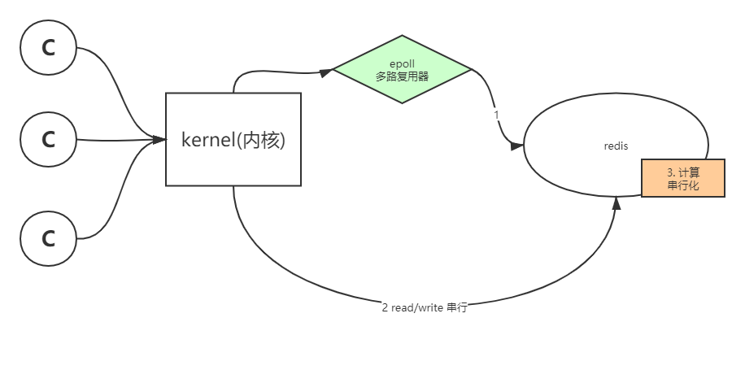

# Redis

###1. 安装,部署

###2. 特征
* 运行在内存内
* io模型 epoll
* worker 单线程
* 以key-value形式储存
* value有类型区分（string（字符串，数值）, list（列表）, hash（哈希）, set（集合）, zset（有序集合））
* 每个类型具有本地方法--计算向数据移动（数据在redis内调用本地方法计算后返回结果）
 
 
 
 ###3. 数据类型
* string
    * 字符串
    * 数值
    * bitmap（二维矩阵）

* List
    * 放入有序
    * 同向放入取出：栈
    * 异向放入去除：队列
    * 通过下标取值：数组