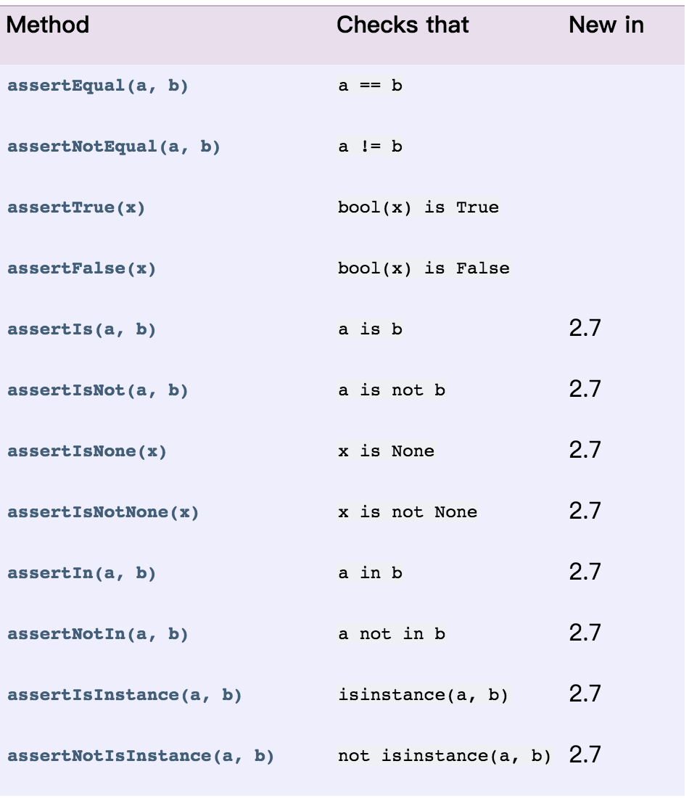
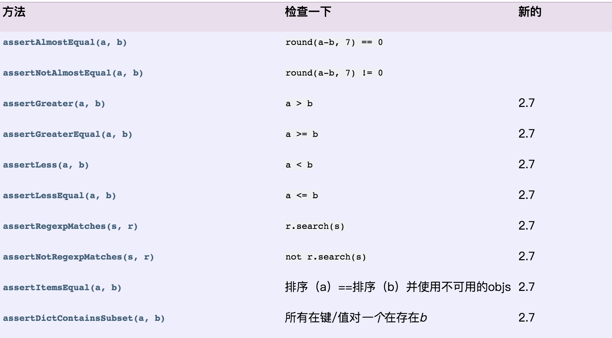

# unitTest

###1. 四大组件

* test fixture: setUp(前置条件), tearDown(后置条件), 用例初始化测试用例及清理和释放资源

* test case: 测试用例，通过集成unittest.TestCase,来实现用例继承，在UnitTest中，测试用例都是通过test来识别的。

* test suite: 测试套件，也称之为测试用例集

* test runner: 运行器，一般通过runner来调用suite去执行用例

##
###2. UnitTest运行机制
* 通过在main函数中调用unittest.main运行所有的用例
```python
import unittest

#通过继承unittest.TestCase实现用例
class TestTample(unittest.TestCase):

    #类初始化前执行
    @classmethod
    def setUpClass(cls) -> None:
        print('setUpClass')
    
    #类释放时使用
    @classmethod
    def tearDownClass(cls) -> None:
        print('tearDownClass')

    # 测试函数初始化前执行
    def setUp(self) -> None:
        print('setUp')
    
    # 测试函数释放资源时执行
    def tearDown(self) -> None:
        print('tearDown')
    
    # 测试用例 (测试用例命名一定要含有test)
    def test_case1(self):
        print("测试用例1")

    def test_case2(self):
        print("测试用例2")

if __name__ == '__main__':
    unittest.main()
```
* 运行结果
```
Testing started at 16:45 ...
C:\Project\devloping\unitestDemo\venv\Scripts\python.exe C:\IDE\PyCharm2019\plugins\python\helpers\pycharm\_jb_unittest_runner.py --path C:/Project/devloping/unitestDemo/demo/forTest.py
Launching unittests with arguments python -m unittest C:/Project/devloping/unitestDemo/demo/forTest.py in C:\Project\devloping\unitestDemo\demo

setUpClass
setUp
测试用例1
tearDown
setUp
测试用例2
tearDown
tearDownClass


Ran 2 tests in 0.002s

OK
```

##
### 3. DDT 数据驱动
* DDT (Data-Driven design), 在Python ddt作为一个装饰器存在，用来实现数据的参数化，这样就可以将代码和测试数据分开，将代码进行封装，提高复用性。

* 测试数据在本地文件或数据库进行维护。

* 使用方法：使用时在测试类上声明@ddt装饰符，在测试方法上使用@data装饰符；在多需要传入多参数时使用@unpack对参数进行解包；@data装饰符可以将参数当做测试数据传入到测试方法中
```python
import unittest
from ddt import ddt, data, unpack

@ddt
class TestTample(unittest.TestCase):

    @data(('txt11', 'txt12'), ('txt21', 'txt22'), ('txt31', 'txt32'))
    @unpack
    def test_case_b(self, txt1, txt2):
        print(txt1)
        print(txt2)
        print('***********')

if __name__ == '__main__':
    unittest.main()
```

##
### 4. 断言
* 在unitTest中，TestCase已经提供有封装好的断言方法进行断言校验。

* unitTest 常用断言方法





##
### 5. unitTest.skip()用法
* 在case中，对于不需要要运行的用例或特定条件不执行用例，可以应用skip()来实现有条件执行，或者绝对性跳过，用于对指定用例进行不执行操作

* skip的用法：
```python
#无条件跳过
@unittest.skip("无条件跳过")
def test_a(self):
    print(1)

#if有条件跳过
@unittest.skipIf(1 < 2, '这是if的理由')
def test_b(self):
    print(2)

#unless有条件跳过
@unittest.skipUnless(1 > 2, '这是unless的理由')
def test_c(self):
    print(3)

# 如果用例执行失败，则不计入失败case数
@unittest.expectedFailure
def test_d(self):
    raise exception('这是个异常')
    print(4)
```
##
### 6. 测试套件和runner的运行使用：
* 测试套件suite的使用

```python
import unittest
from test_case import *

# 创建一个suite套件
suite = unittest.TestSuite()

# 方法1 向suite套件添加单个测试用例
suite.addTest(test_case('test_a'))
suite.addTest(test_case('test_b'))
suite.addTest(test_case('test_c'))

# 方法2 向suite套件添加多个测试用例
case=[test_case('test_a'),test_case('test_b'),test_case('test_c')]
suite.addTests(case)

# 方法3 向suite套件添加路径下文件名满足规则的所有测试用例
test_dir='./'
discover = unittest.defaultTestLoader.discover(start_dir=test_dir, pattern="test*.py")
suite.addTests(discover)

# 方法4 向suite套件添加类名添加测试用例
tclass = unittest.TestLoader().loadTestsFromName('test_case.TestCase')
suite.addTests(tclass)

# 套件通过TextTestRunner对象运行，类似于unittest.main()
runner = unittest.TextTestRunner()
runner.run(suite)
```

##
### 7.HtmlTestRunner


##
### 8.beautifulReport